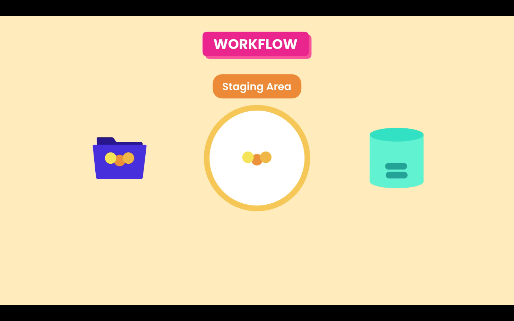

# Git Workflow

It starts with making changes to the files in the **_Working Directory_**

Post modification the changes are moved to **_Staging_** or **_Index_** area. Files in these area will be in the next commit.

Then the next commit is made to the **_Repository_**.



**NOTE:** Post commit the **Staging Area** it is not emptied, now it contains the same snapshot that was recorded in the repository.

## Git commands

### git add

To add files to the staging area we use the `git add` command:

```bash
git add file1 file2
```

We can add multiple files at the same time or use `git add .` to add all files, that have been changed, in the current directory recursively.

### git commit

To record the snapshot to the repository we use the `git commit` command, with the `-m` flag and a meaningful message, about the changes we have made.

```bash
git commit -m "Initial commit"
```

Each commit contains a unique identifier, and also information of what was changed:

```markdown
- ID
- Message
- Date / time
- Author
- Complete snapshot of the project
```

```markdown
commit d5djdpep4md5sdf6sd748sd57sd (HEAD -> main, origin/main)
Author: user user <my-email@code.com>
Date: Fri Mar 5 12:00:00 2021 -0300

    First commit
```
