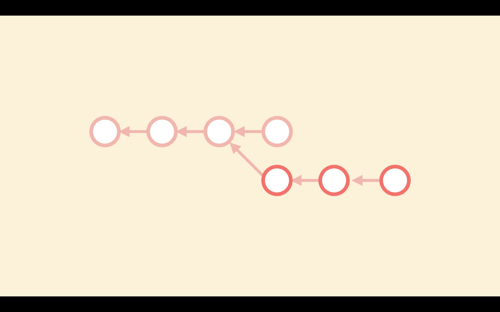

# What are Branches

Branches allows us to work in an isolated environment from the main line. So branches are a kind of separate isolated workspace.

The principal line of work (branch) is called **_master_** or **_main_**. When we need to work, for example, on a new feature we can create a new branch to work on that feature. And when we are done we merge the new feature branch into the **_main_** branch.

## How does git manages branches

When we create a new branch Git creates a new pointer for that branch. When we work in that branch and make new commits Git moves that pointer forward, and the master pointer stays where it is. This way Git knows the latest code in each branch. To know in which branch we are working on, Git uses the **HEAD** pointer, when we switch banchs Git points the **HEAD** pointer to the branch we want to work on, and updates the **Working Directory** accordingly.

